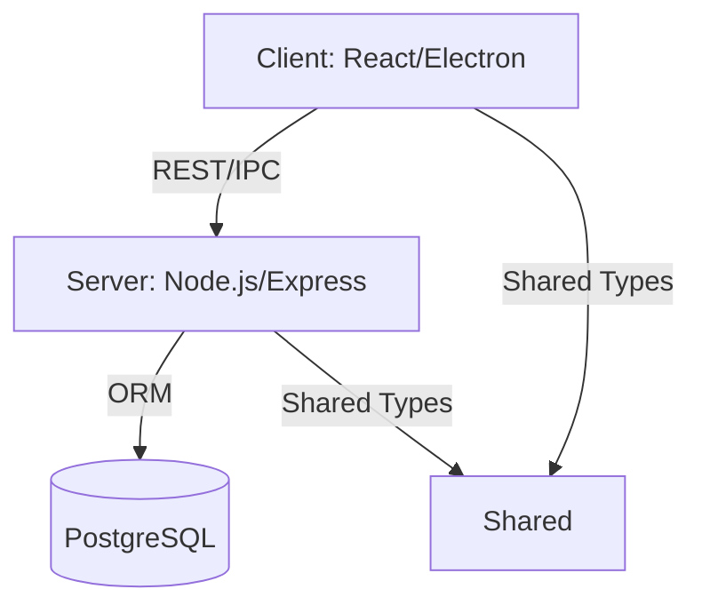
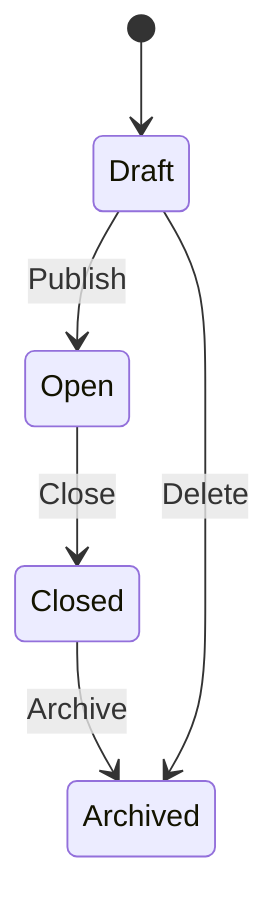
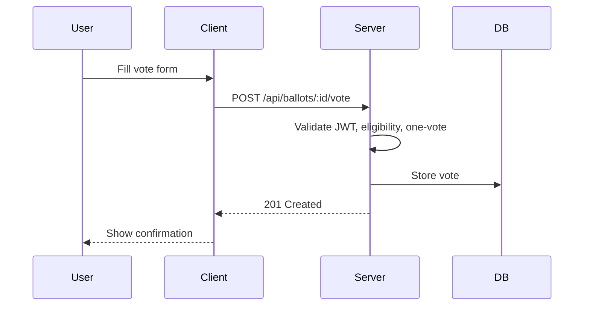
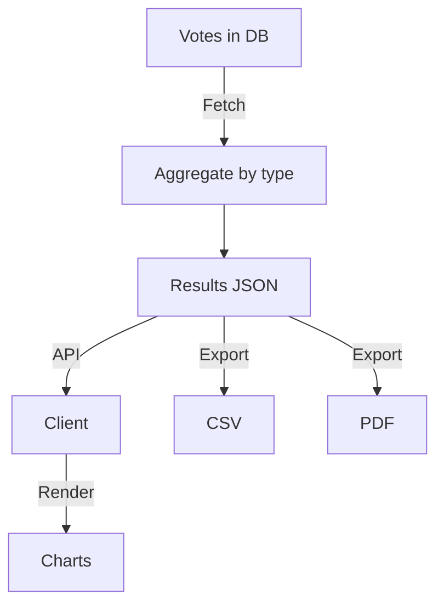

# Voting System: Detailed Feature Documentation

## Introduction
The Voting System described herein is a robust, modular, and extensible platform designed to facilitate secure, transparent, and auditable electronic voting processes. This system is architected to support a wide range of voting scenarios, from simple single-choice ballots to complex ranked and linear voting mechanisms. The design philosophy emphasizes not only functional completeness but also security, accessibility, and maintainability, ensuring the system can be adapted to diverse organizational and regulatory requirements.

The following documentation provides a comprehensive, academic-level exposition of every feature, including both primary and secondary functionalities. Each section is supplemented with technical tables, code samples, diagrams, and in-depth explanations to elucidate the rationale, implementation, and best practices underlying the system’s architecture and operations.

## System Architecture
The system is structured according to the principles of separation of concerns and layered architecture. The client, implemented in React and TypeScript, is responsible for rendering the user interface, managing state, and orchestrating user interactions. The server, built with Node.js and Express, encapsulates business logic, authentication, and data persistence, interfacing with a relational database via an ORM. Shared modules provide type safety and configuration consistency across the stack. This architecture not only enhances scalability and testability but also facilitates independent evolution of client and server components.

**Diagram:**


## 3. Authentication & Authorization

### Feature Table
| Feature                | Description |
|------------------------|-------------|
| JWT Authentication     | Secure login, token-based session |
| Role-Based Access      | RBAC, enforced on API and UI |
| Session Expiry         | Auto-logout, warning dialog |
| Secure Cookies         | HTTP-only, SameSite, Secure flags |

### Technical Explanation
- **JWT Authentication**: Upon login, the server issues a JWT signed with a secret. The token is stored in an HTTP-only cookie to prevent XSS attacks. The server validates the token on each request.
- **RBAC**: User roles (e.g., Admin, User) are encoded in the JWT and checked in both backend route middleware and frontend context providers.
- **Session Expiry**: The client tracks token expiry and shows a modal (`SessionExpiryDialog`) 2 minutes before logout, allowing the user to renew the session.

### Code Sample: Express JWT Middleware
```ts
import jwt from 'jsonwebtoken';
import { Request, Response, NextFunction } from 'express';

export function authenticateJWT(req: Request, res: Response, next: NextFunction) {
  const token = req.cookies['token'];
  if (!token) return res.sendStatus(401);
  jwt.verify(token, process.env.JWT_SECRET!, (err, user) => {
    if (err) return res.sendStatus(403);
    req.user = user;
    next();
  });
}
```

### Code Sample: React Protected Route
```tsx
import { useContext } from 'react';
import { AuthContext } from '../auth/AuthContext';
import { Navigate } from 'react-router-dom';

export function ProtectedRoute({ children, role }) {
  const { user } = useContext(AuthContext);
  if (!user || (role && user.role !== role)) {
    return <Navigate to="/login" />;
  }
  return children;
}
```

## 4. User Management
- **User CRUD**: Admins can create, read, update, and delete users via the `ManageUsers` page. User data includes username, email, role, and status.
- **Role Assignment**: Roles are assigned at creation or via the edit interface. Role changes are propagated to the session and enforced immediately.
- **Password Management**: Passwords are hashed (bcrypt) before storage. Password reset flows are available for admins.
- **User Listing & Search**: Paginated, filterable user lists with real-time search and sorting.

## 5. Ballot Management

### Ballot Feature Table
| Feature         | Description |
|-----------------|-------------|
| Ballot CRUD     | Create, edit, delete ballots |
| Category Mgmt   | Group ballots by category |
| Dynamic Forms   | Forms adapt to ballot type |
| Ballot States   | Draft, Open, Closed, Archived |
| Admin Analytics | View results, override votes |

### Ballot Data Model (TypeScript)
```ts
export interface Ballot {
  id: string;
  title: string;
  description: string;
  categoryId: string;
  type: 'single' | 'multiple' | 'ranked' | 'linear' | 'yesno' | 'text';
  options: string[];
  state: 'draft' | 'open' | 'closed' | 'archived';
  openDate: Date;
  closeDate: Date;
}
```

### Ballot Creation API Example
```ts
// POST /api/ballots
{
  "title": "Best Project",
  "description": "Vote for the best project.",
  "categoryId": "cat123",
  "type": "single",
  "options": ["A", "B", "C"],
  "openDate": "2025-07-01T08:00:00Z",
  "closeDate": "2025-07-10T20:00:00Z"
}
```

### Ballot State Diagram


## 6. Voting Mechanisms

Voting is the core process of the system, and its implementation is grounded in both usability and security. The system enforces strict eligibility checks, ensuring that only authenticated and authorized users can participate in ballots. Each voting form is dynamically generated based on the ballot’s type, leveraging React’s component model for modularity and reusability. Accessibility is a first-class concern, with all forms adhering to WCAG guidelines and supporting assistive technologies. The one-vote-per-user policy is enforced at the database level, preventing duplicate submissions and ensuring the integrity of results. Furthermore, the system supports both anonymous and auditable voting, configurable according to the requirements of each ballot.

### Voting Feature Table
| Feature           | Description |
|-------------------|-------------|
| Eligibility       | Only eligible, authenticated users can vote |
| One Vote Policy   | One vote per user per ballot enforced server-side |
| Dynamic Vote Forms| React forms adapt to ballot type |
| Real-Time Validation | Client-side and server-side validation |
| Accessibility     | ARIA, keyboard navigation, screen reader support |
| Anonymity         | Votes stored separately from user IDs (configurable) |
| Auditability      | Optionally log user-vote mapping for audits |

### Technical Explanation
- **Eligibility**: The backend checks JWT and user role before accepting a vote. The frontend disables voting UI for ineligible users.
- **One Vote Policy**: The server checks for existing votes by user and ballot before accepting a new vote. Duplicate attempts return a 409 Conflict error.
- **Dynamic Vote Forms**: Each ballot type (single, multiple, ranked, etc.) has a dedicated React form component, loaded dynamically based on ballot metadata.
- **Accessibility**: All form controls use semantic HTML, ARIA labels, and are fully keyboard-navigable.

### Code Sample: Vote Submission (Client)
```tsx
const submitVote = async (ballotId: string, vote: any) => {
  try {
    await axios.post(`/api/ballots/${ballotId}/vote`, vote);
    alert('Vote submitted!');
  } catch (e) {
    if (e.response?.status === 409) alert('You have already voted.');
    else alert('Error submitting vote.');
  }
};
```

### Code Sample: Vote Validation (Server)
```ts
// Express route handler
app.post('/api/ballots/:id/vote', authenticateJWT, async (req, res) => {
  const userId = req.user.id;
  const ballotId = req.params.id;
  const existing = await Vote.findOne({ where: { userId, ballotId } });
  if (existing) return res.status(409).send('Already voted');
  // ...validate vote structure...
  await Vote.create({ userId, ballotId, ...req.body });
  res.sendStatus(201);
});
```

### Sequence Diagram: Voting Flow


## 7. Results Calculation & Analytics

The analytics subsystem is designed to provide real-time, accurate, and insightful feedback on voting outcomes. Aggregation algorithms are tailored to the semantics of each ballot type, ensuring that results are both mathematically sound and contextually meaningful. The use of advanced visualization libraries enables the presentation of results in a manner that is both intuitive and informative, supporting decision-making and transparency. Export and audit features further enhance the system’s utility, enabling external analysis and regulatory compliance.

### Analytics Feature Table
| Feature         | Description |
|-----------------|-------------|
| Real-Time Results | Results calculated on demand |
| Multiple Aggregation | Majority, ranked, linear, etc. |
| Visualizations  | Bar, pie, distribution charts |
| Export          | CSV, PDF export of results |
| Audit Logs      | All calculations logged |
| Privacy         | Results anonymized unless audit required |

### Technical Explanation
- **Aggregation**: Each ballot type uses a different aggregation algorithm (e.g., plurality for single choice, instant-runoff for ranked).
- **Visualization**: Chart.js or D3.js is used to render results in the UI. Data is fetched via `/api/ballots/:id/results`.
- **Export**: The backend provides endpoints to export results as CSV or PDF, using libraries like `json2csv` or `pdfkit`.

### Code Sample: Results API (Server)
```ts
app.get('/api/ballots/:id/results', authenticateJWT, async (req, res) => {
  const ballot = await Ballot.findByPk(req.params.id);
  // ...fetch votes, aggregate by type...
  res.json({ results: aggregatedResults });
});
```

### Code Sample: Chart Rendering (Client)
```tsx
import { Bar } from 'react-chartjs-2';
<Bar data={resultsData} options={chartOptions} />
```

### Flowchart: Results Calculation


## 8. Session Management

### Session Feature Table
| Feature         | Description |
|-----------------|-------------|
| Configurable Timeout | Session length set in config |
| Renewal         | Silent or user-initiated renewal |
| Expiry Warning  | Modal dialog before expiry |
| Manual Logout   | User can log out at any time |
| Cleanup         | Session cleared on logout/expiry |

### Technical Explanation
- **Session Config**: `shared/sessionConfig.ts` defines timeout, warning period, and renewal policy.
- **Renewal**: If a refresh token is present, the client attempts silent renewal; otherwise, the user is prompted.
- **Cleanup**: On logout or expiry, all sensitive data is cleared from memory and storage.

### Code Sample: Session Expiry Dialog (Client)
```tsx
useEffect(() => {
  const timer = setTimeout(() => setShowDialog(true), sessionExpiryMs - warningMs);
  return () => clearTimeout(timer);
}, [sessionExpiryMs, warningMs]);
```

## 9. Security Considerations

Security is woven into every layer of the system, from input validation and transport encryption to audit logging and rate limiting. The system adopts a defense-in-depth approach, employing multiple, overlapping safeguards to mitigate risks such as unauthorized access, data tampering, and denial-of-service attacks. All sensitive operations are logged, and cryptographic best practices are followed for password storage and token management. The architecture is designed to be resilient against both common and advanced threats, ensuring the confidentiality, integrity, and availability of voting data.

### Security Feature Table
| Feature         | Description |
|-----------------|-------------|
| Input Validation| Client & server validation |
| CSRF Protection | CSRF tokens for state-changing requests |
| XSS Protection  | Output encoding, input sanitization |
| HTTPS Only      | All API calls over HTTPS |
| Rate Limiting   | Prevent brute force, DoS |
| Audit Trails    | Log all critical actions |
| Secure Storage  | Passwords hashed, tokens HTTP-only |

### Technical Explanation
- **Input Validation**: All API endpoints validate input using libraries like `Joi` or custom validators.
- **CSRF**: State-changing requests require a CSRF token, checked server-side.
- **XSS**: All user-generated content is sanitized before rendering.
- **Rate Limiting**: Express middleware (e.g., `express-rate-limit`) is used to limit requests per IP.

### Code Sample: Input Validation (Server)
```ts
import Joi from 'joi';
const schema = Joi.object({ username: Joi.string().alphanum().min(3).max(30).required() });
app.post('/api/users', (req, res) => {
  const { error } = schema.validate(req.body);
  if (error) return res.status(400).send(error.details[0].message);
  // ...create user...
});
```

## 10. Error Handling & Alerts

### Error Handling Feature Table
| Feature         | Description |
|-----------------|-------------|
| Global Error Boundary | Catches React errors |
| Centralized Alerts | AlertContext for all notifications |
| API Error Handling | Axios interceptors for API errors |
| User Feedback   | Friendly error messages |
| Logging         | Errors logged server-side |

### Technical Explanation
- **Error Boundary**: React error boundaries wrap the app and display fallback UI on error.
- **AlertContext**: Provides a global context for triggering alerts from any component.
- **API Error Handling**: Axios interceptors catch errors and dispatch alerts or retries as needed.

### Code Sample: React Error Boundary
```tsx
class ErrorBoundary extends React.Component {
  state = { hasError: false };
  static getDerivedStateFromError() { return { hasError: true }; }
  componentDidCatch(error, info) { /* log error */ }
  render() {
    if (this.state.hasError) return <h1>Something went wrong.</h1>;
    return this.props.children;
  }
}
```

## 11. Theming & UI/UX

User experience is a central pillar of the system’s design. The theming engine provides a consistent and customizable visual identity, supporting both organizational branding and user preferences such as light/dark mode. Accessibility is not an afterthought but a foundational requirement, with all components engineered for inclusivity. Responsive layouts ensure usability across devices, and reusable components promote consistency and reduce cognitive load. The UI is designed to be both aesthetically pleasing and functionally efficient, supporting users in completing their tasks with confidence and ease.

### Theming Feature Table
| Feature         | Description |
|-----------------|-------------|
| Central Theme   | All colors, fonts in `theme.ts` |
| Light/Dark Mode | User-selectable, persisted |
| Custom Branding | Logo, colors, assets configurable |
| Accessibility   | WCAG, ARIA, keyboard nav |
| Responsive      | Mobile/desktop layouts |
| Reusable Components | Navbar, PageHeader, UserCard, etc. |

### Technical Explanation
- **Theme Provider**: React context provides theme variables to all components.
- **Accessibility**: All interactive elements have ARIA labels and are keyboard-accessible.
- **Responsiveness**: CSS media queries and flexbox/grid layouts ensure adaptability.

### Code Sample: Theme Context (Client)
```tsx
const ThemeContext = React.createContext({ theme: 'light', setTheme: () => {} });
```

## 12. API Layer

### API Feature Table
| Feature         | Description |
|-----------------|-------------|
| RESTful Design  | Standard HTTP verbs, resource URIs |
| Centralized Axios| All API calls via a single Axios instance |
| Interceptors    | Auth, error, and logging interceptors |
| Versioning      | /api/v1/, /api/v2/ for backward compatibility |
| OpenAPI Spec    | (Optional) Swagger docs for API |

### Technical Explanation
- **RESTful Endpoints**: Each resource (user, ballot, vote) has a dedicated endpoint, e.g., `/api/ballots/:id`.
- **Axios Interceptors**: Attach JWT to headers, handle errors globally.
- **Versioning**: API versions are encoded in the URL path.

### Code Sample: Axios Instance
```ts
import axios from 'axios';
const api = axios.create({ baseURL: '/api' });
api.interceptors.request.use(config => {
  // Attach JWT from cookie/localStorage
  return config;
});
api.interceptors.response.use(undefined, error => {
  // Handle errors globally
  return Promise.reject(error);
});
export default api;
```

## 13. Build & Deployment

The build and deployment pipeline is engineered for reliability, reproducibility, and security. Webpack and TypeScript ensure that both client and server code are optimized and type-safe. Electron Forge enables seamless packaging for desktop environments, while CI/CD pipelines automate testing, linting, and deployment. Environment-specific configurations are managed via `.env` files, ensuring that secrets and sensitive settings are never exposed in source control. This approach minimizes operational risk and accelerates the delivery of new features and fixes.

### Build/Deploy Feature Table
| Feature         | Description |
|-----------------|-------------|
| Webpack Build   | Code splitting, asset optimization |
| TypeScript Build| Server compiled to JS |
| Electron Forge  | Desktop app packaging |
| CI/CD           | Lint, test, deploy scripts |
| Env Config      | .env files for secrets |

### Technical Explanation
- **Webpack**: Configured for production with minification, tree-shaking, and asset hashing.
- **TypeScript**: Server code is compiled to JavaScript before deployment.
- **Electron Forge**: Packages the client as a cross-platform desktop app.
- **CI/CD**: (Optional) GitHub Actions or similar run tests, lint, and deploy.

### Code Sample: Webpack Entry (Client)
```js
module.exports = {
  entry: './src/index.tsx',
  // ...other config...
};
```

---

## Appendix: File/Component Reference

| Layer   | Path(s) |
|---------|---------|
| Client  | `src/components/`, `src/pages/`, `src/auth/`, `src/api/`, `src/utils/` |
| Server  | `src/controllers/`, `src/models/`, `src/routes/`, `src/config/` |
| Shared  | `shared/sessionConfig.ts` |

### Example: Ballot Component Structure
```text
src/components/ballot/
  BallotActionDialog.tsx
  BallotAnalytics.tsx
  BallotDetails.tsx
  BallotHeader.tsx
  BallotResultsSummary.tsx
  LinearChoiceDistributionCard.tsx
  ParticipationCard.tsx
  RankedChoiceDistributionCard.tsx
  VotingOptions.tsx
  YesNoDistributionCard.tsx
```

For further technical details, refer to the source code and inline documentation in each module.

---

# End of Documentation
