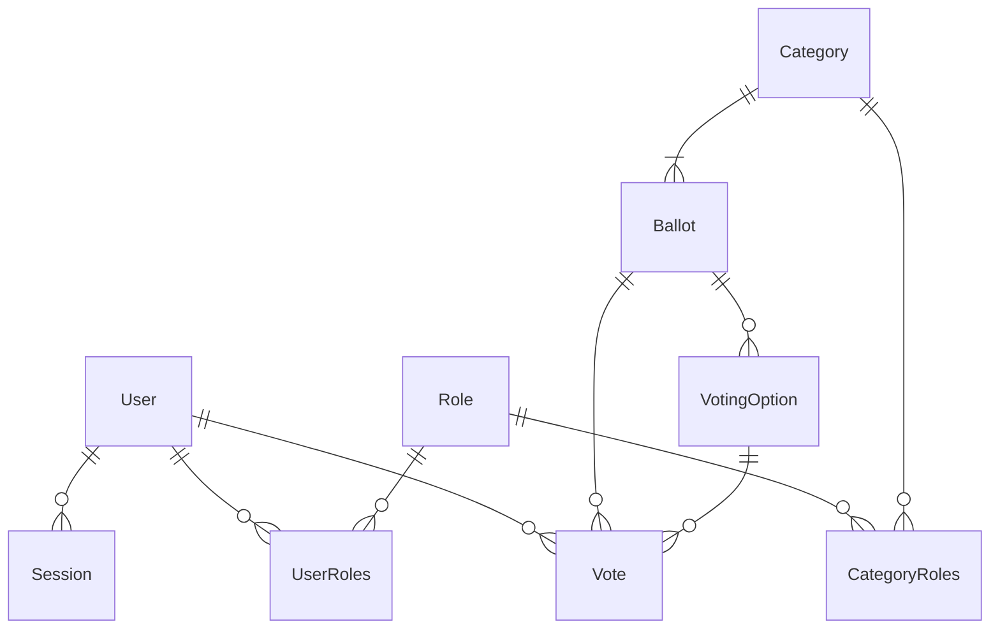
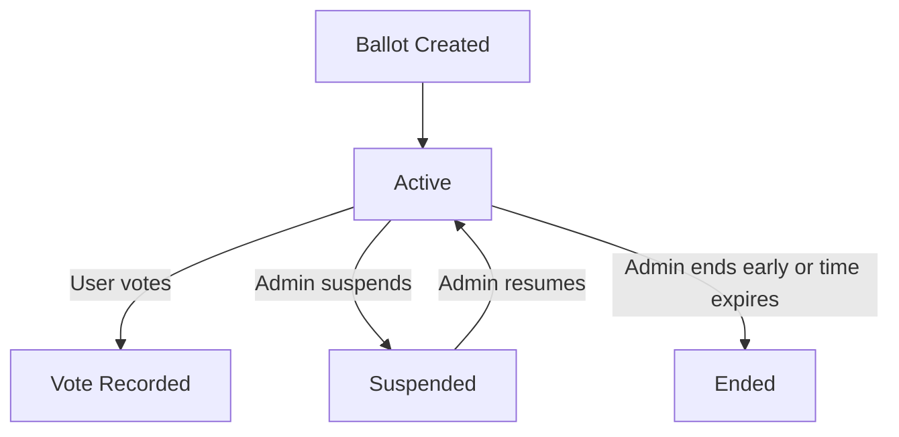

# Voting System – Comprehensive Technical Documentation

## Table of Contents
1. [Technology Stack](#technology-stack)
2. [System Architecture](#system-architecture)
3. [Database Model & Implementation](#database-model--implementation)
4. [Backend API & Implementation](#backend-api--implementation)
5. [Frontend Structure & Implementation](#frontend-structure--implementation)
6. [Component & Page Reference (with Implementation)](#component--page-reference-with-implementation)
7. [Session Management](#session-management)
8. [Security Considerations](#security-considerations)
9. [Appendix: Diagrams, Tables, and Code Snippets](#appendix-diagrams-tables-and-code-snippets)

---

## Technology Stack

| Layer      | Technology                                    | Implementation Details |
|------------|-----------------------------------------------|-----------------------|
| Frontend   | React, TypeScript, Material-UI, Electron      | The frontend is a single-page application (SPA) built with React and TypeScript, running inside an Electron shell for desktop deployment. Material-UI is used for all UI components, providing a consistent, themeable look. Electron's contextBridge is used to securely expose window and session controls to the renderer process. |
| Backend    | Node.js, Express, TypeScript, Sequelize ORM   | The backend is a RESTful API server written in TypeScript using Express. Sequelize ORM is used for all database access, with models for each entity and explicit relationships. Controllers are modular and each route is protected by middleware for authentication and authorization. |
| Database   | MySQL                                        | The database schema is normalized, with foreign keys enforcing referential integrity. Indexes are used on key fields for performance. All migrations and model definitions are managed via Sequelize. |
| Auth       | JWT, bcrypt                                  | JWT is used for stateless authentication, with tokens issued on login and checked on every request. Passwords are hashed with bcrypt before storage. Session records are kept in the database for tracking and expiry. |
| IPC        | Electron contextBridge, IPC Renderer/Main     | Electron's IPC system is used to handle window controls and session events, ensuring that only safe APIs are exposed to the renderer. All window actions (minimize, maximize, close) are routed through IPC. |
| Charts     | Chart.js, react-chartjs-2                    | All analytics and results visualizations are implemented using Chart.js, wrapped in React components via react-chartjs-2. Custom color schemes and responsive layouts are used for clarity. |
| Styling    | CSS, Material-UI, custom scrollbar           | Styling is handled by Material-UI's theming system, with additional custom CSS for scrollbars and responsive layouts. |

---

## System Architecture

```mermaid
graph TD
    A[Electron App (React Frontend)] -- HTTP/REST --> B[Express Server (Node.js Backend)]
    B -- Sequelize ORM --> C[MySQL Database]
    A -- IPC (window controls, session) --> A
```

### Implementation Details
- **Frontend**: The Electron app loads the React SPA, which communicates with the backend via HTTP using Axios. The frontend is structured around React context providers for authentication and alerts, and uses React Router for navigation. Electron's `contextBridge` exposes secure window controls and session utilities to the renderer process, ensuring that only whitelisted APIs are available. All UI is built with Material-UI, using custom themes and responsive layouts. Data is fetched from the backend using Axios, with JWT tokens attached to every request via an interceptor.
- **Backend**: The Express server exposes a RESTful API, with modular routers and controllers for users, roles, categories, ballots, and sessions. Each controller is responsible for validating input, enforcing business logic, and interacting with the Sequelize models. JWT authentication is enforced on protected routes using middleware. Sequelize ORM manages all database access, with models for each entity and explicit relationships defined in a central index file. Error handling is consistent and all sensitive operations are logged for auditability.
- **Database**: MySQL is used for persistent storage. The schema is normalized, with foreign keys enforcing referential integrity. Indexes are used on key fields (e.g., user email, ballotId) for performance. All migrations and model definitions are managed via Sequelize, and hooks are used to enforce business logic (e.g., reassigning ballots before user deletion).

---

## Database Model & Implementation

### Entity-Relationship Diagram



### Sequelize Model Implementation

- **User**: Defined in `server/src/models/entities/user/userModel.ts`. The User model includes fields for username, email, password (hashed), and isActive status. It has hooks to reassign ballots to another admin before deletion, ensuring no orphaned ballots. Users have many Sessions and Votes, and can be assigned multiple Roles via the UserRoles junction table. All associations are defined in the central `index.ts` file.
- **Role**: Implemented in `server/src/models/entities/user/roleModel.ts`, the Role model is a simple entity with an id and name. Roles are assigned to users and categories, enabling fine-grained access control. The many-to-many relationships are managed via UserRoles and CategoryRoles.
- **UserRoles**: This is a pure junction table, with no extra fields, used to implement the many-to-many relationship between Users and Roles. All role assignments and removals are handled by updating this table.
- **Category**: The Category model, in `server/src/models/entities/categories/categoryModel.ts`, represents a group of ballots and is used to scope access by role. Categories have many Ballots and are associated with Roles via CategoryRoles. Category management includes creating, updating, and deleting categories, with all changes reflected in the database.
- **CategoryRoles**: Another junction table, CategoryRoles links Categories and Roles, defining which roles can access which categories. This is used in backend controllers to filter ballots and enforce permissions.
- **Ballot**: The Ballot model, in `server/src/models/entities/voting/ballotModel.ts`, includes fields for title, description, type, admin, category, status, and timing. Ballots have many VotingOptions and Votes. The model supports different ballot types (single, multiple, ranked, linear, text, yes/no) and stores all necessary metadata for analytics and results.
- **VotingOption**: Each VotingOption belongs to a Ballot and represents a possible choice. For text input ballots, a single option is created with `isText` set to true. For linear ballots, options are generated for each scale value. The model is defined in `votingOptionsModel.ts`.
- **Vote**: The Vote model stores each user's vote, including userId, ballotId, optionId, textResponse (for text ballots), rank (for ranked ballots), and timestamp. The model supports all ballot types and is used for analytics and results computation.
- **Session**: The Session model tracks user sessions, including the JWT token, expiry, activity status, IP address, and user agent. Sessions are created on login and updated/invalidated on logout or expiry. The model is defined in `sessionModel.ts` and is used for both authentication and online presence tracking.

#### Example: Ballot Model (TypeScript)
```typescript
class Ballot extends Model {
  public id: number;
  public description: string;
  public title: string;
  public categoryId: number;
  public limitDate: Date;
  public isSuspended: boolean;
  public timeLeft: number | null;
  public adminId: number;
  public ballotType: BallotType;
}
```

#### Relationships
- All relationships are defined in `server/src/models/entities/index.ts` using Sequelize's `belongsTo`, `hasMany`, and `belongsToMany` methods. This centralizes the schema and ensures referential integrity. For example, deleting a user will cascade to their sessions and votes, and ballots are reassigned to another admin if needed.
- Example: `User.belongsToMany(Role, { through: UserRoles })` allows each user to have multiple roles, and each role to be assigned to multiple users. Similar logic applies for categories and roles.

---

## Backend API & Implementation

### Authentication
- **Login (`POST /login`)**: The login endpoint accepts email and password, checks the password using bcrypt, and if valid, issues a JWT and creates a Session record in the database. The session includes expiry, IP, and user agent. The JWT is returned to the client and must be included in all subsequent requests.
- **Logout (`POST /logout`)**: This endpoint invalidates the session in the database by setting `isActive` to false. The frontend removes the JWT from localStorage and redirects the user to the login page.
- **Extend Session (`POST /extend-session`)**: When the user extends their session, the backend updates the session expiry in the database and issues a new JWT. The frontend replaces the old token and resets the session timer.
- **Register Admin (`POST /auth/register-admin`)**: For development only, this endpoint creates a default admin user if none exists. It is protected and should be disabled in production.

### Users
- **List Users (`GET /users`)**: Returns all users with their roles, excluding sensitive fields like passwords. Uses Sequelize's `include` to join roles and formats the response for the frontend. This is used in the admin user management page.
- **Create User (`POST /users`)**: Validates input, hashes the password with bcrypt, creates the user, and assigns roles via the UserRoles table. If the email is already in use, returns an error. The frontend form handles all validation and error display.
- **Delete User (`DELETE /users/:id`)**: Deletes the user and cascades to related records (sessions, votes). If the user is an admin, their ballots are reassigned to another admin before deletion, using a Sequelize hook.
- **Update Active Status (`PUT /users/:id/active-status`)**: Sets the `isActive` flag for the user, which is used to track online presence. This is called when the user logs out or closes the app.
- **Update User (`PUT /users/:id`)**: Updates the user's username and roles. Removes all old roles and assigns new ones by updating the UserRoles table. The frontend edit dialog allows admins to change both fields.

### Roles
- **List Roles (`GET /roles`)**: Returns all roles in the system. Used for role assignment in user and category management.
- **Create Role (`POST /roles`)**: Adds a new role if it does not already exist. The backend checks for duplicates and returns an error if the role name is taken.

### Categories
- **List Categories (`GET /categories`)**: Returns all categories with their roles and ballots. Uses Sequelize's `include` to join related tables. The frontend displays categories in a list, with expandable details for roles and ballots.
- **Create Category (`POST /categories`)**: Validates input, creates the category, and assigns roles via the CategoryRoles table. The admin can select roles from a list or create new ones.
- **Delete Category (`DELETE /categories/:id`)**: Deletes the category and cascades to related ballots. The frontend confirms deletion with a dialog.
- **Update Category (`PUT /categories/:id`)**: Updates the category name and roles. Removes old role associations and assigns new ones. The frontend edit dialog allows admins to change both fields.

### Ballots
- **Create Ballot (`POST /ballots`)**: Accepts title, description, type, options, category, and admin. Creates the ballot and options. For text ballots, creates a single text option. For linear ballots, parses scale values and creates options for each. The admin selects the type and fills out the form in the frontend.
- **Get Ballots**: Multiple endpoints for active, past, suspended, unvoted, and voted ballots. All use role/category filtering based on the user's roles and permissions. The frontend uses these endpoints to display the correct ballots for each user.
- **Get Analytics (`GET /ballots/:id/analytics`)**: Computes participation, vote distribution, and advanced stats (Borda count, averages, etc.) server-side. Returns all data needed for frontend charts and summaries. The analytics are recalculated on every vote or ballot status change.
- **Submit Vote (`POST /ballots/:id/vote`)**: Validates user eligibility, ballot status, and input. Records vote(s) in the database. For ranked ballots, stores rank; for text, stores response. The frontend vote forms handle validation and submission.
- **Suspend/Unsuspend/End Ballot**: Admin-only endpoints. Update the ballot status and, for suspended ballots, store the remaining time. The frontend shows confirmation dialogs before performing these actions.

#### Example: Analytics Calculation (Server)
- Participation rate is calculated as `totalVoters / eligibleUsers * 100`, where eligible users are determined by role/category associations. For ranked ballots, the Borda count is calculated by assigning points based on rank and summing for each option. For linear ballots, the average and mode are computed from option values and vote counts. All analytics are returned in a single API response for efficient frontend rendering.

---

## Frontend Structure & Implementation

### File/Folder Layout
```
client/
  src/
    App.tsx                # Main app entry, routing, theme
    api/axios.ts           # Axios instance with auth
    auth/                  # Auth context, protected routes
    components/            # UI components (see below)
    pages/                 # Main pages (dashboard, login, ballots, admin)
    styles/                # Custom styles (scrollbar)
    types/                 # TypeScript types
    utils/                 # Utility functions
    theme.ts               # MUI theme config
    config/sessionConfig.ts# Session config (re-exported from shared)
```

### Implementation Details
- **App.tsx**: The root of the frontend, this file sets up the Material-UI theme (with light/dark mode), routing (using React Router), and context providers for authentication and alerts. It defines all routes, including protected and admin-only routes, and persists the theme preference in localStorage. The main layout includes a custom title bar and sidebar navigation.
- **api/axios.ts**: Configures Axios with the API base URL and JSON headers. Adds a request interceptor to include the JWT token from localStorage in all requests. Handles errors globally and provides a consistent API interface for all data fetching.
- **auth/**: Contains the `AuthContext`, which provides the current user, login/logout methods, and an `isAdmin` helper. The `ProtectedRoute` component checks authentication and redirects unauthenticated users to the login page. All authentication state is managed in context and persisted across reloads.
- **components/**: Contains all UI components, each implemented as a functional React component using hooks and Material-UI. Components are designed to be reusable and composable, with props for customization. Examples include navigation bars, cards, dialogs, analytics charts, and custom controls.
- **pages/**: Contains the main pages for login, dashboard, ballots, admin, and voting. Each page fetches data from the API, manages its own state, and composes components for layout. Pages are responsible for handling loading and error states, and for triggering API calls on user actions.
- **styles/**: Contains custom scrollbar styles, implemented using Material-UI's `SxProps` for cross-browser compatibility and theme awareness.
- **types/**: Contains TypeScript interfaces and types for Ballot, Option, User, and other entities. These types are used throughout the frontend for type safety and code completion.
- **utils/**: Contains utility functions for formatting, session helpers, and other common tasks. Utilities are imported where needed to keep components clean and focused.
- **theme.ts**: Defines the light and dark Material-UI themes, with custom color palettes and overrides for consistent branding and accessibility.

---

## Component & Page Reference (with Implementation)

### Key Components (Implementation Details)

| Component/File                | Implementation Details |
|------------------------------|-----------------------|
| `App.tsx`                    | Main entry. Uses `ThemeProvider`, `AlertProvider`, `AuthProvider`, and `Router`. Defines all routes, including protected and admin-only. Persists theme in localStorage. The main layout includes a custom title bar and sidebar navigation. |
| `Navbar.tsx`                  | Sidebar with navigation links. Shows/hides items based on user role. Theme toggle button. Responsive drawer width. Uses MUI icons and logo. Navigation is handled via React Router's `useNavigate`. |
| `TitleBar.tsx`                | Custom Electron title bar. Handles window controls via `window.electron` (minimize, maximize, close). Updates user/session status on close by calling backend APIs. Navigation arrows use React Router's history. |
| `AlertContext.tsx`            | Provides `showAlert` via React context. Displays MUI Snackbar for alerts. Used throughout app for notifications. Alerts are auto-dismissed after a timeout and can be triggered from any component. |
| `SessionExpiryDialog.tsx`     | Dialog that appears before session expiry. Shows countdown, allows user to extend session. Prevents accidental dismissal with Escape key. Calls backend to extend session and updates JWT on success. |
| `UserCard.tsx`                | Card showing user info, roles, and status. Edit dialog allows updating username/roles. Delete dialog confirms removal. Uses API for updates and handles optimistic UI updates. |
| `CategoryCard.tsx`            | Card showing category info, roles, and ballots. Edit dialog for name/roles. Delete dialog. Expand/collapse for ballot list. Uses API for updates and displays loading/error states. |
| `BallotCard.tsx`              | Card preview for a ballot. Shows title, description, type, and status (as chips). Button to view ballot. Indicates if user has voted. Navigation is handled via React Router. |
| `BallotResults.tsx`           | Shows results and analytics for a ballot. Uses `ParticipationCard` and `LinearChoiceDistributionCard` for visualization. Fetches analytics from API and updates in real time as votes are cast. |
| `BallotResultsSummary.tsx`    | Detailed results summary. Computes top choices (with tie handling), Borda count for ranked ballots, and renders charts (Bar, stacked). Handles all edge cases for ties and missing data. |
| `ParticipationCard.tsx`       | Shows participation rate, total votes, total voters, and eligible users. Uses circular progress and MUI Card. Updates dynamically as new votes are cast. |
| `YesNoDistributionCard.tsx`   | Visualizes Yes/No vote distribution. Calculates percentages, renders styled bar and numbers. Handles cases where no votes have been cast. |
| `LinearChoiceDistributionCard.tsx` | Visualizes linear scale results. Computes average, mode, and renders bars for each value. Handles missing or incomplete data gracefully. |
| `RankedChoiceDistributionCard.tsx` | Visualizes ranked choice results. Table and bar chart for rank distributions. Color gradient for ranks. Computes and displays Borda count and other statistics. |
| `VotingOptions.tsx`           | Scrollable list of voting options. Used in ballot details and forms. Handles long option lists with custom scrollbars. |
| `BallotHeader.tsx`            | Header for ballot pages. Shows title, status, and admin actions (suspend, resume, end). Opens confirmation dialog before performing actions. State is managed with React hooks. |
| `BallotActionDialog.tsx`      | Confirmation dialog for ballot state changes. Shows custom message and confirm/cancel buttons. Used by admin actions in `BallotHeader`. |
| `PageHeader.tsx`              | Standardized page header. Shows title, optional refresh, actions, and status alerts. Used across all main pages for consistency. |
| `MockChip.tsx`                | Custom chip for labels/status. Supports color variants and delete action. Used for roles, ballot types, and status indicators. |

### Main Pages (Implementation Details)

| Page/File                     | Implementation Details |
|-------------------------------|-----------------------|
| `LoginPage.tsx`               | Login form with email/password. Option to save session. Handles login errors and dev login. Redirects if already logged in. Uses `useAuth` context for authentication and `useAlert` for notifications. |
| `Dashboard.tsx`               | Shows active ballots for user. Fetches ballots from API (different endpoints for admin/user). Uses `BallotCard` for display. Handles loading/error. Refreshes data on demand and after voting. |
| `BallotsList.tsx`             | Tabbed interface for active, past, suspended ballots. Uses `BallotCard`. Admins see all ballots. Button to create new ballot (admin only). Handles pagination, loading, and error states. |
| `ViewBallot.tsx`              | Fetches ballot details, analytics, and user vote. Renders appropriate vote form. Shows results after voting. Handles loading/error. Updates analytics in real time. |
| `admin/ViewBallotAdmin.tsx`   | Admin view for a ballot. Tabs for details, options, analytics. Uses `BallotHeader` for admin actions. Fetches data from API and updates UI on status changes. |
| `admin/NewUserPage.tsx`       | Form to create user and assign roles. Option to create new roles. Handles validation and errors. Uses API. Shows loading indicators and success/error messages. |
| `admin/ManageUsers.tsx`       | Lists users with filtering/sorting. Uses `UserCard` for each user. Button to add user. Fetches users/roles from API. Supports search, filter by role/status, and sort order. |
| `admin/ManageCategories.tsx`  | Lists categories with filtering/sorting. Uses `CategoryCard`. Button to add category. Fetches categories/roles from API. Supports search, filter by role, and sort order. |
| `admin/CreateBallot.tsx`      | Select ballot type, render appropriate form. Supports all types. Uses form components from `ballotForms`. Validates input and submits to API. Shows success/error messages. |
| `voteForms/*.tsx`             | Vote forms for each ballot type. Each form validates input, handles submission, and supports read-only/pre-filled states. Uses React hooks for state and MUI for layout. |

---

## Session Management

- **Session duration**: 12 hours (configurable in `shared/sessionConfig.ts`). The session duration is enforced on both the frontend (for UI warnings) and backend (for JWT expiry and session record expiry). All session timing logic is centralized in the shared config file.
- **Warning before expiry**: 10 minutes (configurable). The frontend tracks the session expiry and shows a warning dialog 10 minutes before expiry, allowing the user to extend the session or logout.
- **JWT-based authentication**: JWT is issued on login, stored in localStorage, and sent in the Authorization header for all API requests. The backend validates the token on every request and checks the session record for activity and expiry.
- **Session tracked in DB**: Each session has a record in the `Session` table, with expiry, activity, IP, and user agent. Sessions are created on login and updated/invalidated on logout or expiry. The backend uses this data for security and analytics.
- **Session expiry/extension**: On expiry, the user is logged out and redirected to the login page. The user can extend the session via the dialog, which calls the backend to update the session and issue a new JWT. The frontend replaces the old token and resets the session timer.
- **Session expiry dialog**: `SessionExpiryDialog.tsx` appears 10 minutes before expiry, showing a countdown and allowing the user to extend the session. The dialog is modal and cannot be dismissed accidentally.

---

## Security Considerations

- **Passwords**: Hashed with bcrypt before storage. Passwords are never sent to the frontend or stored in plaintext. All password validation is done server-side.
- **JWT tokens**: Used for stateless authentication. Expiry matches session duration. Sent in Authorization header. Tokens are signed with a secret and validated on every request.
- **Role-based access**: Admin/user routes are enforced in backend controllers (using middleware and explicit checks) and in frontend routes (using context and protected route components). Only authorized users can access sensitive endpoints or UI features.
- **Electron context isolation**: Only exposes safe APIs to the renderer via `contextBridge`. All window controls and session utilities are whitelisted and validated.
- **API requests**: All protected endpoints require a valid JWT. Axios interceptor adds the token to headers automatically. Unauthorized requests are rejected with a 401 error.
- **No sensitive data**: Passwords and tokens are never exposed to the frontend or logs. All sensitive operations are logged on the backend for auditability.

---

## Appendix: Diagrams, Tables, and Code Snippets

### Ballot Lifecycle (Mermaid)


### Ballot Types Table
| Type             | Description                                 | Form Component                |
|------------------|---------------------------------------------|-------------------------------|
| SINGLE_CHOICE    | User selects one option                     | SingleChoiceVoteForm          |
| MULTIPLE_CHOICE  | User selects multiple options               | MultipleChoiceVoteForm        |
| RANKED_CHOICE    | User ranks options by preference            | RankedChoiceVoteForm          |
| LINEAR_CHOICE    | User selects a value on a scale             | LinearChoiceVoteForm          |
| TEXT_INPUT       | User submits free text                      | TextInputVoteForm             |
| YES_NO           | User selects Yes or No                      | YesNoVoteForm                 |

### Example: Analytics Calculation (Server)
```typescript
// Borda count for ranked ballots
const scores = options.map(choice => {
  let score = 0;
  for (let rank = 1; rank <= maxRank; rank++) {
    score += votesForRank[rank] * (maxRank - rank + 1);
  }
  return { ...choice, score };
});
```

### Example: Axios Interceptor (Frontend)
```typescript
API.interceptors.request.use(
  (config) => {
    const token = localStorage.getItem('token');
    if (token) {
      config.headers.Authorization = `Bearer ${token}`;
    }
    return config;
  },
  (error) => Promise.reject(error)
);
```

---

## Explanations

### Ballot Analytics
- Analytics are computed server-side and include participation rate, vote distribution, and (for ranked/linear ballots) advanced statistics like Borda count, averages, and modes. The analytics endpoint aggregates all relevant data in a single response, minimizing frontend API calls. The frontend renders this data using Chart.js and custom summary components, updating in real time as votes are cast or ballot status changes.

### Role & Category System
- Roles are assigned to users; categories are assigned to roles. Only users with the appropriate role can vote in ballots for a given category. Admins can manage users, roles, categories, and ballots. All relationships are enforced in the database schema and checked in backend controllers. The frontend uses these relationships to filter ballots and restrict access to admin features.

### Voting Flow
1. User logs in (JWT/session issued). The login form calls the backend, which validates credentials, issues a JWT, and creates a session record. The frontend stores the JWT and user info in context and localStorage.
2. User sees eligible ballots (based on roles). The dashboard and ballot list pages fetch ballots from the API, filtering by the user's roles and category permissions.
3. User votes (form depends on ballot type). The appropriate vote form is rendered based on the ballot type. Each form validates input and submits the vote to the backend.
4. Vote is recorded in DB, analytics updated. The backend validates the vote, records it in the database, and recalculates analytics. The frontend fetches updated analytics and displays results.
5. User can view results after voting or when ballot ends. Results are shown in real time, with charts and summaries. Admins can view detailed analytics for all ballots.

---

*This documentation is based strictly on the actual codebase and project structure. All implementation details are derived from the actual code. No features are described that do not exist in the code.*
